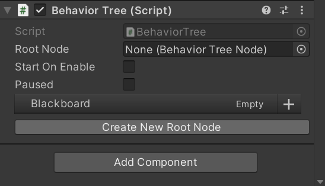

# OpenBehaviorTrees
 A collection of behavior tree scripts for developing game AI.

## How to Get Started

The first thing to do is add the behavior tree component to a GameObject

You will be presented with a button that allows you to create a new tree from a Behavior Tree Root node

Once you have created your new tree, you will be presented with the option to open it.

## The Node Editor Window

You will be presented with a node editor window for managing and editing Behavior Trees.
In the node editor, you can zoom using the scroll wheel, move around using the mouse, and select 
nodes for inspection. You can also select multiple nodes simultaneously by holding shift.

You can also copy and paste nodes by right-clicking to open a context menu:

## Nodes List

You can view all placeable nodes by opening the Nodes List sidebar. All non-abstract node types will be visible 
in this window, including any nodes that you create that inherit from the BehaviorTreeNode class. Also in the window
will be any existing behavior trees you have created, which can be placed as a sub-tree. This helps with modularity
and readibility of trees. You may search for nodes using the searchbar at the top of the nodes list view.

## Inspector

The Inspector window works exactly like the Unity's built-in inspector window. You may also set an icon for a Node type,
which will be visible in the project window and on the nodes in the Node Editor Window.

## Final Notes

- Any changes made to the tree will only be applied by using the save button.
- Standard behavior tree node types are available, such as Selector, Sequencer, Inverter, Always Fail, and more.
- Also available is a UtilitySelector node, for implementing Utility AI/ GOAP behaviors. Children of UtilitySelector must inherit from UtilityEvaluator.
- Scripts are contained in the OpenBehaviorTree namespace.
- More Information about the blackboard can be found [Here](https://github.com/Sterberino/UnitySerializedDictionary)
- Documentation will come soon
